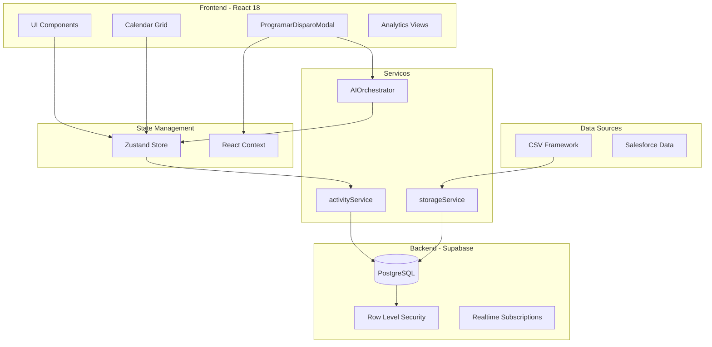
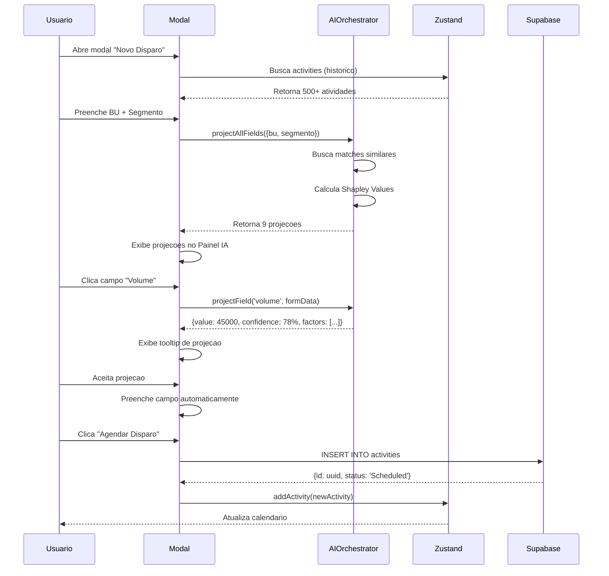
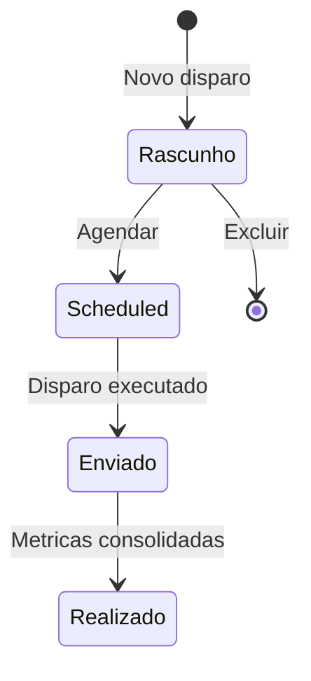
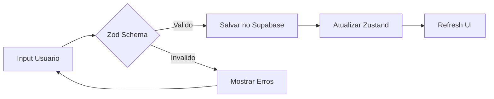
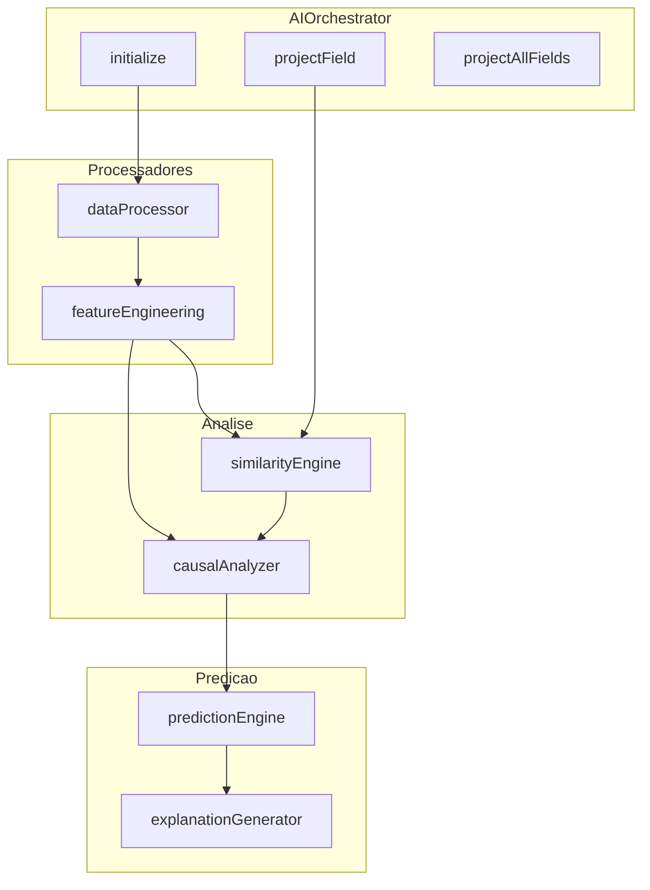

# GaaS Framework - Documentacao Tecnica Completa

**Versao:** 2.0
**Data:** 2026-01-30
**Status:** Producao
**Autor:** Growth Marketing Team

---

## Sumario

1. [Contexto & Proposito](#1-contexto--proposito)
2. [Arquitetura](#2-arquitetura)
3. [Modelo de Dados - 40+ Colunas](#3-modelo-de-dados---40-colunas)
4. [Schemas & Validacoes](#4-schemas--validacoes)
5. [Componentes Principais](#5-componentes-principais)
6. [Regras de Negocio](#6-regras-de-negocio)
7. [Banco de Dados](#7-banco-de-dados)
8. [Decisoes Tecnicas](#8-decisoes-tecnicas)
9. [Sistema de IA - AIOrchestrator](#9-sistema-de-ia---aiorchestrator)
10. [Calculos de Custo](#10-calculos-de-custo)
11. [Glossario](#11-glossario)

---

## 1. Contexto & Proposito

### 1.1 O que e o GaaS Framework

**GaaS (Growth as a Service)** e o sistema central de gestao de disparos CRM da operacao de Growth Marketing. O framework consolida:

- **Historico de Campanhas:** Todos os disparos realizados via Salesforce Marketing Cloud
- **Programacao Futura:** Agendamento de novos disparos com projecoes de IA
- **Analise de Performance:** Metricas de funil (entrega -> conversao -> cartoes)
- **Otimizacao Baseada em Dados:** Sugestoes inteligentes para maximizar ROI

### 1.2 Problema que Resolve

| Problema Anterior | Solucao GaaS |
|------------------|--------------|
| Dados fragmentados em multiplas planilhas | Base unica Supabase com 40+ colunas |
| Falta de visao temporal de campanhas | Calendario visual interativo |
| Decisoes baseadas em intuicao | Projecoes IA com causalidade |
| Dificuldade de planejamento | Modal de programacao com auto-preenchimento |
| Custos calculados manualmente | Calculo automatico por canal/oferta |

### 1.3 Dores de Negocio Resolvidas

1. **Fragmentacao de Dados**
   - Antes: Dados em Excel, Sheets, e-mails
   - Depois: Fonte unica de verdade no Supabase

2. **Falta de Projecoes Confiaveis**
   - Antes: Estimativas manuais sem base historica
   - Depois: IA com Shapley Values e analise de causalidade

3. **Dificuldade de Planejamento**
   - Antes: Criar disparos era lento e sujeito a erros
   - Depois: Auto-fill de campos + sugestoes baseadas em historico

4. **Visibilidade de Performance**
   - Antes: Relatorios estaticos mensais
   - Depois: Dashboard em tempo real com 9 metricas projetadas

---

## 2. Arquitetura

### 2.1 Stack Tecnologico

| Camada | Tecnologia | Versao | Proposito |
|--------|------------|--------|-----------|
| **Frontend** | React | 18.x | UI declarativa com hooks |
| **Linguagem** | TypeScript | 5.2.x | Tipagem estatica rigorosa |
| **Build** | Vite | 5.0.x | Build rapido com HMR |
| **Estilos** | Tailwind CSS | 3.3.x | Utility-first CSS (dark mode) |
| **Estado** | Zustand | 5.0.x | State management minimalista |
| **Backend** | Supabase | 2.93.x | PostgreSQL + Auth + RLS |
| **Validacao** | Zod | 3.x | Schema validation runtime |
| **Charts** | Recharts | 3.5.x | Visualizacoes interativas |
| **CSV** | Papaparse | 5.4.x | Parse CSV (Latin-1/UTF-8) |

### 2.2 Diagrama de Arquitetura



### 2.3 Fluxo de Dados



### 2.4 Estrutura de Pastas

```
calendar-estrategico/
├── docs/
│   └── GAAS_FRAMEWORK_DOCUMENTATION.md   # Este arquivo
├── public/
│   └── assets/
├── src/
│   ├── components/
│   │   ├── dispatch/
│   │   │   ├── ProgramarDisparoModal.tsx # Modal principal (754 linhas)
│   │   │   ├── blocks/                   # Blocos do layout
│   │   │   │   ├── IdentificationBlock.tsx
│   │   │   │   ├── ScheduleBlock.tsx
│   │   │   │   ├── ProductOfferBlock.tsx
│   │   │   │   ├── InvestmentBlock.tsx
│   │   │   │   └── AIProjectionBlock.tsx
│   │   │   ├── ai/                       # Componentes de IA
│   │   │   │   ├── FieldProjectionTooltip.tsx
│   │   │   │   ├── ConfidenceBar.tsx
│   │   │   │   └── CausalFactorsList.tsx
│   │   │   └── context/
│   │   │       └── DispatchFormContext.tsx
│   │   ├── Calendar.tsx
│   │   ├── DayCell.tsx
│   │   ├── CSVUpload.tsx
│   │   └── analise/                      # Componentes de analise
│   ├── constants/
│   │   └── frameworkFields.ts            # Custos e helpers
│   ├── hooks/
│   │   ├── useFrameworkData.ts
│   │   └── useRecommendationEngine.ts
│   ├── schemas/
│   │   └── ActivityFormSchema.ts         # Validacao Zod
│   ├── services/
│   │   ├── activityService.ts            # CRUD Supabase
│   │   ├── supabaseClient.ts
│   │   └── ml/                           # Motor de IA
│   │       ├── types.ts
│   │       ├── AIOrchestrator.ts
│   │       ├── causalAnalyzer.ts
│   │       ├── predictionEngine.ts
│   │       └── explanationGenerator.ts
│   ├── store/
│   │   └── useAppStore.ts                # Zustand store
│   ├── types/
│   │   └── activity.ts                   # ActivityRow (40+ campos)
│   ├── utils/
│   │   └── intelligentSuggestions.ts     # Engine de sugestoes
│   └── workers/
│       └── csvWorker.ts                  # Web Worker para CSV
├── tailwind.config.js
├── vite.config.ts
└── package.json
```

---

## 3. Modelo de Dados - 40+ Colunas

### 3.1 Visao Geral das Colunas

O Framework Growth utiliza **45 colunas** organizadas em 7 categorias:

| Categoria | Qtd Colunas | Descricao |
|-----------|-------------|-----------|
| Identificacao | 5 | IDs unicos e controle interno |
| Segmentacao | 8 | BU, Segmento, Parceiros |
| Produto & Oferta | 8 | Ofertas, Promocionais, Produtos |
| Temporal | 5 | Datas, Horarios, Safra |
| Metricas de Base | 3 | Volume, Base Acionavel |
| Metricas Financeiras | 6 | Custos, CAC |
| Metricas de Funil | 10 | Taxas de conversao |
| **Total** | **45** | |

### 3.2 Colunas Detalhadas por Categoria

#### 3.2.1 Identificacao (5 colunas)

| Coluna | Tipo | Obrigatorio | Descricao |
|--------|------|-------------|-----------|
| `id` | UUID | Sim | Identificador unico (gerado) |
| `Activity name / Taxonomia` | String | Sim | Nome unico da atividade no Salesforce |
| `prog_gaas` | Boolean | Sim | `true` = criado no GaaS, `false` = importado |
| `status` | Enum | Sim | 'Rascunho' \| 'Scheduled' \| 'Enviado' \| 'Realizado' |
| `created_at` | Timestamp | Sim | Data de criacao (auto) |
| `updated_at` | Timestamp | Sim | Data de atualizacao (auto) |

#### 3.2.2 Segmentacao (8 colunas)

| Coluna | Tipo | Obrigatorio | Descricao | Exemplo |
|--------|------|-------------|-----------|---------|
| `BU` | Enum | Sim | Business Unit | 'B2C' \| 'B2B2C' \| 'Plurix' |
| `Segmento` | String | Sim | Segmento de mercado | 'Aquisicao', 'Retencao' |
| `SIGLA_Segmento` | String | Nao | Sigla do segmento | 'ACQ', 'RET' |
| `Parceiro` | String | Nao | Parceiro comercial | 'Riachuelo', 'Marisa' |
| `SIGLA_Parceiro` | String | Nao | Sigla do parceiro | 'RCH', 'MRS' |
| `Subgrupos` | String | Nao | Subgrupo do segmento | 'Premium', 'Standard' |
| `Etapa de aquisicao` | Enum | Nao | Etapa do funil | 'Aquisicao', 'Meio_de_Funil' |
| `Perfil de Credito` | String | Nao | Perfil de risco | 'Gold', 'Silver', 'Bronze' |

#### 3.2.3 Produto & Oferta (8 colunas)

| Coluna | Tipo | Obrigatorio | Descricao | Exemplo |
|--------|------|-------------|-----------|---------|
| `Produto` | String | Nao | Tipo de produto | 'Classic', 'Gold' |
| `Oferta` | String | Sim* | Oferta principal | 'Padrao', 'Limite', 'Vibe' |
| `Promocional` | String | Nao | Promocional associado | '10% cashback' |
| `SIGLA_Oferta` | String | Nao | Sigla da oferta | 'PDR', 'LMT' |
| `Oferta 2` | String | Nao | Oferta secundaria | 'Anuidade gratis' |
| `Promocional 2` | String | Nao | Promocional secundario | 'Frete gratis' |
| `jornada` | String | Sim | Nome da jornada CRM | 'Carrinho Abandonado' |
| `Canal` | Enum | Sim | Canal de comunicacao | 'E-mail', 'SMS', 'WhatsApp', 'Push' |

*Obrigatorio Oferta OU Promocional

#### 3.2.4 Temporal (5 colunas)

| Coluna | Tipo | Obrigatorio | Formato | Descricao |
|--------|------|-------------|---------|-----------|
| `Data de Disparo` | Date | Sim | YYYY-MM-DD | Data de envio |
| `Data Fim` | Date | Sim | YYYY-MM-DD | Data fim da campanha |
| `Horario de Disparo` | Time | Nao | HH:MM | Horario de envio |
| `Safra` | String | Nao | mmm/aa | Safra do disparo (jan/26) |
| `Ordem de disparo` | Integer | Nao | 1-999 | Sequencia no dia |

#### 3.2.5 Metricas de Base (3 colunas)

| Coluna | Tipo | Descricao | Exemplo |
|--------|------|-----------|---------|
| `Base Total` | Integer | Volume total de registros | 50000 |
| `Base Acionavel` | Integer | Registros acionaveis | 45000 |
| `% Otimizacao de base` | Decimal | Percentual otimizado | 0.90 |

#### 3.2.6 Metricas Financeiras (6 colunas)

| Coluna | Tipo | Formula | Descricao |
|--------|------|---------|-----------|
| `Custo Unitario Oferta` | Decimal | - | Custo por registro (oferta) |
| `Custo Total da Oferta` | Decimal | Volume × Custo Unit. | Total oferta |
| `Custo unitario do canal` | Decimal | Tabela fixa por canal | Custo por envio |
| `Custo total canal` | Decimal | Volume × Custo Unit. | Total canal |
| `Custo Total Campanha` | Decimal | Custo Oferta + Custo Canal | Investimento total |
| `CAC` | Decimal | Custo Total / Cartoes | Custo de Aquisicao |

#### 3.2.7 Metricas de Funil (10 colunas)

| Coluna | Tipo | Descricao | Range |
|--------|------|-----------|-------|
| `Taxa de Entrega` | Decimal | % entregues | 0.00-1.00 |
| `Taxa de Abertura` | Decimal | % abertos | 0.00-1.00 |
| `Taxa de Clique` | Decimal | % clicados | 0.00-1.00 |
| `Taxa de Proposta` | Decimal | % propostas | 0.00-1.00 |
| `Taxa de Aprovacao` | Decimal | % aprovados | 0.00-1.00 |
| `Taxa de Finalizacao` | Decimal | % finalizados | 0.00-1.00 |
| `Taxa de Conversao` | Decimal | % convertidos | 0.00-1.00 |
| `Propostas` | Integer | Qtd propostas geradas | - |
| `Aprovados` | Integer | Qtd aprovados | - |
| `Cartoes Gerados` | Integer | Qtd cartoes emitidos | - |

### 3.3 TypeScript Interface

```typescript
// src/types/activity.ts

export type ActivityStatus = 'Rascunho' | 'Scheduled' | 'Enviado' | 'Realizado';

export interface ActivityRow {
    // Identificadores
    id: string;                              // UUID

    // Controle Interno GaaS
    prog_gaas: boolean;
    status: ActivityStatus;
    created_at: string;
    updated_at: string;

    // Campos Core (Dimensoes Principais)
    BU: 'B2C' | 'B2B2C' | 'Plurix' | string;
    jornada: string;
    'Activity name / Taxonomia': string;
    Canal?: string;
    'Data de Disparo': string;               // YYYY-MM-DD
    'Data Fim': string;                      // YYYY-MM-DD
    Safra?: string;

    // Segmentacao & Parceiros
    Parceiro?: string;
    SIGLA_Parceiro?: string;
    Segmento: string;
    SIGLA_Segmento?: string;
    Subgrupos?: string;
    'Etapa de aquisicao'?: string;
    'Perfil de Credito'?: string | null;

    // Ofertas
    Produto?: string;
    Oferta?: string | null;
    Promocional?: string | null;
    SIGLA_Oferta?: string;
    'Oferta 2'?: string | null;
    'Promocional 2'?: string | null;
    'Ordem de disparo'?: number;

    // Metricas de Base
    'Base Total'?: number;
    'Base Acionavel'?: number;
    '% Otimizacao de base'?: number;

    // Metricas Financeiras
    'Custo Unitario Oferta'?: number;
    'Custo Total da Oferta'?: number;
    'Custo unitario do canal'?: number;
    'Custo total canal'?: number;
    'Custo Total Campanha'?: number;
    CAC?: number;

    // Metricas de Funil (Taxas)
    'Taxa de Entrega'?: number;
    'Taxa de Abertura'?: number;
    'Taxa de Clique'?: number;
    'Taxa de Proposta'?: number;
    'Taxa de Aprovacao'?: number;
    'Taxa de Finalizacao'?: number;
    'Taxa de Conversao'?: number;

    // Volumes (Resultados)
    'Cartoes Gerados'?: number;
    Aprovados?: number;
    Propostas?: number;
    'Emissoes Independentes'?: number;
    'Emissoes Assistidas'?: number;

    // Horario de Disparo
    'Horario de Disparo'?: string;           // HH:MM formato
}
```

---

## 4. Schemas & Validacoes

### 4.1 ActivityFormSchema (Zod)

```typescript
// src/schemas/ActivityFormSchema.ts

import { z } from 'zod';

export const ActivityFormSchema = z.object({
    // Obrigatorios
    bu: z.enum(['B2C', 'B2B2C', 'Plurix']),

    jornada: z.string()
        .min(5, 'Minimo 5 caracteres')
        .max(250, 'Maximo 250 caracteres'),

    activityName: z.string()
        .min(2, 'Minimo 2 caracteres')
        .max(250, 'Maximo 250 caracteres'),

    dataInicio: z.string()
        .refine(
            (date) => new Date(date) >= new Date(new Date().setHours(0, 0, 0, 0)),
            'Nao pode ser data passada'
        ),

    dataFim: z.string(),

    horarioDisparo: z.string()
        .regex(/^\d{2}:\d{2}$/, 'Formato: HH:MM'),

    canal: z.enum(['E-mail', 'Push', 'SMS', 'WhatsApp']),

    // Calculados automaticamente
    safra: z.string().optional(),
    ordemDisparo: z.number().optional(),

    // Opcionais de segmentacao
    perfilCredito: z.string().optional(),
    oferta: z.string().optional(),
    promocional: z.string().optional(),
    oferta2: z.string().optional(),
    promocional2: z.string().optional(),
    parceiro: z.string().optional(),
    subgrupo: z.string().optional(),
    etapaAquisicao: z.string().optional(),
    produto: z.string().optional(),
    baseVolume: z.string().optional(),

    // Custos (opcionais)
    custoUnitarioOferta: z.string().optional(),
    custoTotalOferta: z.string().optional(),
    custoUnitarioCanal: z.string().optional(),
    custoTotalCanal: z.string().optional(),
    custoTotalCampanha: z.string().optional(),

    status: z.enum(['Rascunho', 'Scheduled', 'Enviado', 'Realizado'])
        .default('Rascunho'),
})
    // Validacao: Data Fim >= Data Inicio
    .refine(
        (data) => new Date(data.dataFim) >= new Date(data.dataInicio),
        { message: 'Data Fim >= Data Inicio', path: ['dataFim'] }
    )
    // Validacao: Pelo menos Oferta OU Promocional
    .refine(
        (data) => data.oferta || data.promocional,
        { message: 'Selecione pelo menos Oferta OU Promocional', path: ['oferta'] }
    );

export type ActivityFormInput = z.infer<typeof ActivityFormSchema>;
```

### 4.2 Regras de Validacao

| Campo | Regra | Mensagem de Erro |
|-------|-------|------------------|
| `bu` | Enum obrigatorio | "BU e obrigatorio" |
| `jornada` | 5-250 caracteres | "Minimo 5 caracteres" |
| `activityName` | 2-250 caracteres | "Minimo 2 caracteres" |
| `dataInicio` | >= hoje | "Nao pode ser data passada" |
| `dataFim` | >= dataInicio | "Data Fim >= Data Inicio" |
| `horarioDisparo` | Regex HH:MM | "Formato: HH:MM" |
| `canal` | Enum obrigatorio | "Canal e obrigatorio" |
| `oferta OR promocional` | Pelo menos 1 | "Selecione Oferta OU Promocional" |

---

## 5. Componentes Principais

### 5.1 ProgramarDisparoModal

**Arquivo:** `src/components/dispatch/ProgramarDisparoModal.tsx`
**Linhas:** ~754
**Proposito:** Modal principal para criacao/edicao de disparos

#### Layout: 5 Blocos Horizontais

```
+------------------------------------------------------------------------+
|  HEADER: Novo Disparo / Editar Disparo                             [X] |
+------------------------------------------------------------------------+
|                                                                        |
|  +-----------+ +----------+ +--------------+ +-----------+ +--------+  |
|  | BLOCO 1   | | BLOCO 2  | | BLOCO 3      | | BLOCO 4   | | BLOCO 5|  |
|  | Identif.  | | Cronog.  | | Prod.&Oferta | | Investim. | | IA     |  |
|  | 220px     | | 180px    | | 200px        | | 200px     | | 280px  |  |
|  +-----------+ +----------+ +--------------+ +-----------+ +--------+  |
|                                                                        |
+------------------------------------------------------------------------+
|  [Cancelar]              [Salvar Rascunho]         [Agendar Disparo]   |
+------------------------------------------------------------------------+
```

#### Campos por Bloco

**Bloco 1 - Identificacao:**
- BU (select)
- Segmento (select)
- Nome da Atividade (input)
- Jornada (input com datalist)
- Canal (select)
- Parceiro (input)
- Subgrupo (input)

**Bloco 2 - Cronograma:**
- Data Inicio (date)
- Data Fim (date)
- Horario (time)
- Safra (readonly, calculado)
- Ordem (readonly, calculado)

**Bloco 3 - Produto & Oferta:**
- Produto (select)
- Perfil Credito (select)
- Etapa do Funil (select)
- Oferta (input)
- Promocional (input)
- Oferta 2 (input)
- Promocional 2 (input)

**Bloco 4 - Investimento:**
- Volume da Base (number)
- Custo Unit. Oferta (readonly)
- Custo Unit. Canal (readonly)
- Custo Total Campanha (readonly)

**Bloco 5 - Painel IA (9 metricas):**
- Volume projetado
- Taxa Conversao projetada
- Base Acionavel projetada
- CAC projetado
- Taxa Entrega projetada
- Taxa Abertura projetada
- Propostas projetadas
- Aprovados projetados
- Cartoes projetados

### 5.2 Hooks de Auto-Preenchimento

O modal possui **10 useEffect hooks** para auto-preenchimento:

| # | Hook | Trigger | Acao |
|---|------|---------|------|
| 1 | Form Init | `editingActivity` | Preenche form com dados existentes |
| 2 | Data Fim | `dataInicio` | dataFim = dataInicio + 2 dias |
| 3 | Safra | `dataInicio` | Gera safra (jan/26) |
| 4 | Ordem | `jornada + dataInicio` | Calcula ordem sequencial |
| 5 | Activity Name | `bu + seg + jornada` | Sugere nome padrao |
| 6 | Custo Canal | `canal` | Busca custo unitario |
| 7 | Custo Oferta | `oferta` | Busca custo unitario |
| 8 | Custos Totais | `volume + custos unit.` | Calcula totais |
| 9 | Projecoes IA | `bu + seg + perfil + canal` | Calcula projecoes |
| 10 | Sugestoes | `bu + seg + jornada` | Sugere campos opcionais |

---

## 6. Regras de Negocio

### 6.1 BU (Business Unit)

| BU | Cor | Hex | Descricao |
|----|-----|-----|-----------|
| B2C | Azul | #3B82F6 | Business to Consumer |
| B2B2C | Verde | #10B981 | Business to Business to Consumer |
| Plurix | Roxo | #A855F7 | Plataforma Plurix |

**Regra:** BU e selecionada MANUALMENTE pelo usuario (nao inferida).

### 6.2 Segmento

O segmento vem dos **filtros globais** do app, mas pode ser alterado no modal.

Segmentos comuns:
- Aquisicao
- Retencao
- Reativacao
- Cross-sell
- Up-sell

### 6.3 Sistema de Status



| Status | Cor | Editavel | Descricao |
|--------|-----|----------|-----------|
| Rascunho | Cinza | Sim | Em construcao |
| Scheduled | Azul | Sim | Agendado para envio |
| Enviado | Amarelo | Nao | Disparo executado |
| Realizado | Verde | Nao | Metricas consolidadas |

### 6.4 Calculo de Ordem de Disparo

```typescript
// Ordem = quantidade de disparos da mesma jornada no mesmo dia + 1

const calculateOrdemDisparo = (
    jornada: string,
    dataDisparo: string,
    activities: Activity[]
): number => {
    const sameJourneyAndDate = activities.filter(
        a => a.jornada === jornada &&
             a['Data de Disparo'] === dataDisparo
    );
    return sameJourneyAndDate.length + 1;
};
```

### 6.5 Geracao de Safra

```typescript
// Safra = mes/ano no formato mmm/aa

const generateSafra = (date: string): string => {
    const d = new Date(date + 'T00:00:00');
    const monthNames = ['jan', 'fev', 'mar', 'abr', 'mai', 'jun',
                        'jul', 'ago', 'set', 'out', 'nov', 'dez'];
    const month = monthNames[d.getMonth()];
    const year = d.getFullYear().toString().slice(2);
    return `${month}/${year}`;
};

// Exemplo: 2026-01-15 => "jan/26"
```

### 6.6 Activity Name (Taxonomia)

Padrao sugerido automaticamente:

```
{BU}_{SEGMENTO}_{JORNADA}_{ORDEM}_{SAFRA}

Exemplo: B2C_AQUISICAO_CARRINHO_1_JAN26
```

---

## 7. Banco de Dados

### 7.1 Tabela: activities

```sql
CREATE TABLE activities (
    -- Identificadores
    id UUID PRIMARY KEY DEFAULT gen_random_uuid(),

    -- Controle GaaS
    prog_gaas BOOLEAN DEFAULT false,
    status TEXT DEFAULT 'Rascunho' CHECK (status IN ('Rascunho', 'Scheduled', 'Enviado', 'Realizado')),
    created_at TIMESTAMPTZ DEFAULT NOW(),
    updated_at TIMESTAMPTZ DEFAULT NOW(),

    -- Core
    "BU" TEXT NOT NULL CHECK ("BU" IN ('B2C', 'B2B2C', 'Plurix')),
    "jornada" TEXT NOT NULL,
    "Activity name / Taxonomia" TEXT NOT NULL,
    "Canal" TEXT,
    "Data de Disparo" DATE NOT NULL,
    "Data Fim" DATE,
    "Safra" TEXT,

    -- Segmentacao
    "Parceiro" TEXT,
    "SIGLA_Parceiro" TEXT,
    "Segmento" TEXT NOT NULL,
    "SIGLA_Segmento" TEXT,
    "Subgrupos" TEXT,
    "Etapa de aquisicao" TEXT,
    "Perfil de Credito" TEXT,

    -- Produto & Oferta
    "Produto" TEXT,
    "Oferta" TEXT,
    "Promocional" TEXT,
    "SIGLA_Oferta" TEXT,
    "Oferta 2" TEXT,
    "Promocional 2" TEXT,
    "Ordem de disparo" INTEGER,

    -- Metricas Base
    "Base Total" INTEGER,
    "Base Acionavel" INTEGER,
    "% Otimizacao de base" DECIMAL(5,4),

    -- Financeiro
    "Custo Unitario Oferta" DECIMAL(10,4),
    "Custo Total da Oferta" DECIMAL(12,2),
    "Custo unitario do canal" DECIMAL(10,4),
    "Custo total canal" DECIMAL(12,2),
    "Custo Total Campanha" DECIMAL(12,2),
    "CAC" DECIMAL(10,2),

    -- Taxas
    "Taxa de Entrega" DECIMAL(5,4),
    "Taxa de Abertura" DECIMAL(5,4),
    "Taxa de Clique" DECIMAL(5,4),
    "Taxa de Proposta" DECIMAL(5,4),
    "Taxa de Aprovacao" DECIMAL(5,4),
    "Taxa de Finalizacao" DECIMAL(5,4),
    "Taxa de Conversao" DECIMAL(5,4),

    -- Volumes
    "Cartoes Gerados" INTEGER,
    "Aprovados" INTEGER,
    "Propostas" INTEGER,
    "Emissoes Independentes" INTEGER,
    "Emissoes Assistidas" INTEGER,

    -- Horario
    "Horario de Disparo" TIME
);

-- Indices
CREATE INDEX idx_activities_segment ON activities ("Segmento");
CREATE INDEX idx_activities_bu ON activities ("BU");
CREATE INDEX idx_activities_date ON activities ("Data de Disparo");
CREATE INDEX idx_activities_status ON activities (status);
CREATE INDEX idx_activities_prog_gaas ON activities (prog_gaas);
```

### 7.2 Row Level Security (RLS)

```sql
-- Habilitar RLS
ALTER TABLE activities ENABLE ROW LEVEL SECURITY;

-- Policy: Usuarios autenticados podem ler tudo
CREATE POLICY "Read all activities" ON activities
    FOR SELECT USING (true);

-- Policy: Usuarios podem inserir/atualizar apenas prog_gaas = true
CREATE POLICY "Insert GaaS activities" ON activities
    FOR INSERT WITH CHECK (prog_gaas = true);

CREATE POLICY "Update GaaS activities" ON activities
    FOR UPDATE USING (prog_gaas = true);

-- Policy: Apenas admin pode deletar
CREATE POLICY "Delete activities" ON activities
    FOR DELETE USING (auth.role() = 'admin');
```

---

## 8. Decisoes Tecnicas

### 8.1 Por que BU e Manual?

**Problema:** Inferir BU automaticamente a partir de outros campos pode gerar erros.

**Decisao:** BU e um campo de **selecao obrigatoria** pelo usuario.

**Motivo:** A BU determina:
- Cores do calendario
- Filtros de segmento disponiveis
- Regras de negocio especificas
- Custos e metas diferenciados

### 8.2 Diferenca Data Fim vs Data Disparo

| Campo | Proposito | Uso |
|-------|-----------|-----|
| Data de Disparo | Quando a campanha sera enviada | Agendamento no Salesforce |
| Data Fim | Ate quando a campanha e valida | Validade de promocoes |

**Regra:** Data Fim = Data Disparo + 2 dias (padrao, editavel).

### 8.3 Estrategia de Validacao



**Camadas de Validacao:**

1. **Frontend (Zod):** Validacao sincrona antes de enviar
2. **Backend (Supabase):** Constraints e CHECK no PostgreSQL
3. **Runtime (TypeScript):** Tipagem estatica em tempo de desenvolvimento

### 8.4 Por que Zustand?

| Requisito | Redux | Context | Zustand |
|-----------|-------|---------|---------|
| Boilerplate | Alto | Baixo | Minimo |
| Performance | Boa | Media | Excelente |
| DevTools | Sim | Nao | Sim |
| TypeScript | Verboso | OK | Excelente |
| Bundle Size | 7KB | 0KB | 1KB |

**Decisao:** Zustand oferece o melhor equilibrio entre simplicidade e performance.

---

## 9. Sistema de IA - AIOrchestrator

### 9.1 Visao Geral

O AIOrchestrator e o **cerebro do sistema**, responsavel por:

1. Processar 100% das colunas do historico
2. Calcular similaridade multi-dimensional
3. Aplicar algoritmos de causalidade
4. Gerar projecoes com explicabilidade
5. Sugerir valores para TODOS os campos

### 9.2 Arquitetura do Orquestrador



### 9.3 Algoritmos de Causalidade

#### 9.3.1 Feature Importance com Shapley Values

```typescript
interface ShapleyContribution {
    feature: string;
    contribution: number;  // -100 a +100
    direction: 'positive' | 'negative';
}

// Exemplo de output:
// [
//   { feature: 'Canal_WhatsApp', contribution: +15, direction: 'positive' },
//   { feature: 'Perfil_Gold', contribution: +8, direction: 'positive' },
//   { feature: 'Horario_15h', contribution: -5, direction: 'negative' }
// ]
```

#### 9.3.2 Deteccao de Confounders

Variaveis que afetam tanto a feature quanto o outcome:

```
Exemplo:
  Segmento -> Canal (escolha)
  Segmento -> TaxaConversao (resultado)

O Segmento e um CONFOUNDER entre Canal e TaxaConversao.
Predicoes devem ajustar para remover esse vies.
```

#### 9.3.3 Analise de Intervencao

Pergunta causal: "Se eu MUDAR o canal de E-mail para WhatsApp, qual o impacto?"

```typescript
const interventionAnalysis = (
    from: { feature: string, value: string },
    to: { feature: string, value: string },
    confounders: string[]
): InterventionResult => {
    // 1. Filtra campanhas com "from" value
    // 2. Filtra campanhas com "to" value
    // 3. Controla por confounders
    // 4. Calcula ATE (Average Treatment Effect)
    return {
        expectedChange: +15,  // +15% conversao
        confidence: 0.72,
        confoundersControlled: ['Segmento', 'Perfil'],
        sampleSize: { from: 234, to: 189 }
    };
};
```

### 9.4 Logica de Similaridade Multi-Dimensional

```typescript
interface SimilarityWeights {
    // Dimensoes Categoricas (total: 100%)
    BU: 15,
    Segmento: 15,
    Canal: 12,
    Jornada: 10,
    Perfil_Credito: 10,
    Oferta: 8,
    Promocional: 5,
    Parceiro: 5,
    Subgrupo: 5,
    Etapa_Aquisicao: 5,
    Produto: 5,

    // Bonus Temporal
    Temporal: 5,  // Mais recente = mais similar
}
```

**Match Levels:**

| Level | Score | Criterio |
|-------|-------|----------|
| Exact | 100% | Todas dimensoes identicas |
| High | 80% | BU + Segmento + Canal + Perfil |
| Medium | 60% | BU + Segmento |
| Low | 40% | Apenas BU |
| Fallback | 20% | Sem match, media geral |

### 9.5 Metricas Projetaveis (9 metricas)

| # | Metrica | Algoritmo | Formula |
|---|---------|-----------|---------|
| 1 | Volume | Mediana ponderada | Mediana dos matches |
| 2 | Taxa Conversao | Causal + Correlacao | Shapley-adjusted mean |
| 3 | Base Acionavel | % sobre volume | Volume × % medio historico |
| 4 | CAC | Media decaimento 90d | Media dos ultimos 3 meses |
| 5 | Taxa Entrega | Media por canal | Historico do canal |
| 6 | Taxa Abertura | Causal por horario | Ajuste por horario |
| 7 | Propostas | Funnel | Volume × TaxaConv |
| 8 | Aprovados | Funnel | Propostas × TaxaAprov |
| 9 | Cartoes | Funnel | Aprovados × TaxaFinal |

### 9.6 Interface FieldProjection

```typescript
interface FieldProjection {
    field: string;
    projectedValue: number | string;
    confidence: number;                // 0-100
    interval: { min: number; max: number };
    method: 'causal' | 'correlation' | 'frequency' | 'fallback';
    explanation: ProjectionExplanation;
    similarCampaigns: CampaignReference[];
}

interface ProjectionExplanation {
    summary: string;                   // "Baseado em 47 disparos similares"
    causalFactors: CausalFactor[];     // Fatores que CAUSAM o resultado
    correlationFactors: Factor[];      // Fatores correlacionados
    timeDecay: string;                 // "Peso maior para ultimos 30 dias"
    sampleSize: number;
    dataQuality: 'high' | 'medium' | 'low';
}

interface CausalFactor {
    feature: string;                   // "Canal"
    impact: number;                    // -100 a +100
    direction: 'positive' | 'negative';
    explanation: string;               // "WhatsApp aumenta conversao em 15%"
}
```

---

## 10. Calculos de Custo

### 10.1 Custo Unitario por Canal

```typescript
// src/constants/frameworkFields.ts

export const CUSTO_UNITARIO_CANAL: Record<Canal, number> = {
    'E-mail': 0.001,     // R$ 0,001 por envio
    'Push': 0.001,       // R$ 0,001 por envio
    'SMS': 0.064,        // R$ 0,064 por envio
    'WhatsApp': 0.420,   // R$ 0,420 por envio
};
```

### 10.2 Custo Unitario por Oferta

```typescript
export const CUSTO_UNITARIO_OFERTA: Record<string, number> = {
    'Padrao': 0.00,      // Sem custo adicional
    'Limite': 1.00,      // R$ 1,00 por registro
    'Vibe': 2.00,        // R$ 2,00 por registro
    'Anuidade': 76.50,   // R$ 76,50 por registro
};
```

### 10.3 Formulas de Calculo

```typescript
// Custo Total Oferta
const custoTotalOferta = volume * custoUnitarioOferta;

// Custo Total Canal
const custoTotalCanal = volume * custoUnitarioCanal;

// Custo Total Campanha
const custoTotalCampanha = custoTotalOferta + custoTotalCanal;

// CAC (Custo de Aquisicao por Cliente)
const cac = custoTotalCampanha / cartoesGerados;
```

### 10.4 Exemplo Pratico

| Campo | Valor | Calculo |
|-------|-------|---------|
| Volume | 50.000 | - |
| Canal | WhatsApp | - |
| Oferta | Limite | - |
| Custo Unit. Canal | R$ 0,420 | Tabela |
| Custo Unit. Oferta | R$ 1,00 | Tabela |
| Custo Total Canal | R$ 21.000 | 50.000 × 0,420 |
| Custo Total Oferta | R$ 50.000 | 50.000 × 1,00 |
| **Custo Total Campanha** | **R$ 71.000** | 21.000 + 50.000 |
| Cartoes Estimados | 500 | Projecao IA |
| **CAC** | **R$ 142,00** | 71.000 / 500 |

---

## 11. Glossario

| Termo | Definicao |
|-------|-----------|
| **Activity** | Uma campanha/disparo individual no Salesforce |
| **BU** | Business Unit (B2C, B2B2C, Plurix) |
| **CAC** | Customer Acquisition Cost - custo para adquirir um cliente |
| **Confounder** | Variavel que afeta tanto causa quanto efeito |
| **Framework** | Planilha Excel/CSV com historico de campanhas |
| **GaaS** | Growth as a Service - sistema de gestao de growth |
| **Jornada** | Fluxo CRM (ex: Carrinho Abandonado) |
| **Safra** | Periodo de referencia (mes/ano) |
| **Shapley Values** | Metodo para medir contribuicao de cada variavel |
| **Taxonomia** | Nome padronizado da atividade |

---

## Historico de Versoes

| Versao | Data | Mudancas |
|--------|------|----------|
| 1.0 | 2025-10 | Documentacao inicial |
| 2.0 | 2026-01-30 | IA Avancada, Layout compacto, 9 metricas |

---

**Fim do Documento**
