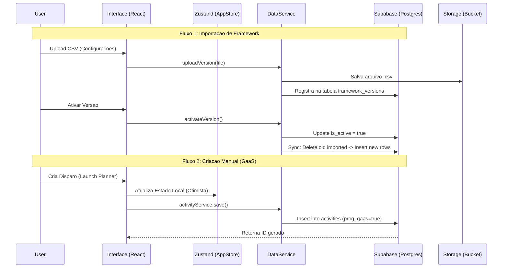
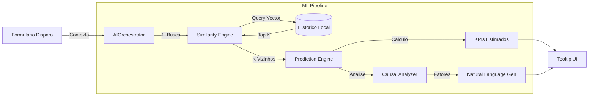

# Arquitetura Visual e Fluxos do Sistema

**Projeto:** Calendario Estrategico
**Versao Documento:** 2.0

Este documento ilustra os principais fluxos de navegacao, dados e estrutura de componentes do sistema.

---

## 1. Mapa de Navegacao (Sitemap)

O sistema utiliza uma estrutura de navegacao lateral (Sidebar) com rotas protegidas.

```mermaid
graph TD
    Login[Login / Auth] -->|Success| Dashboard

    subgraph "Core Navigation"
        Dashboard[/ (Overview)]
        Launch[/launch (Launch Planner)]
        Jornada[/jornada (Jornada & Disparos)]
        Resultados[/resultados (Resultados)]
        Orientador[/orientador (Orientador AI)]
        B2C[/b2c-originacao (Originacao B2C)]
        Media[/midia-paga (Media Analytics)]
        Campanhas[/framework (Campanhas Framework)]
        Diario[/diario (Diario de Bordo)]
        Config[/configuracoes (Admin/Config)]
    end

    Dashboard --> Launch
    Dashboard --> Resultados
    Launch --> ModalDisparo[Modal: Novo Disparo]
    Jornada --> ModalDetalhe[Modal: Detalhe Dia]
    Resultados --> DrillDown[Drill-down Gasto]
    Config --> VersionHistory[Drawer: Historico Versoes]
```

---

## 2. Fluxo de Dados (Supabase Integration)

A sincronizacao de dados ocorre em duas vias principais: Importacao de CSV (Framework) e Criacao Manual (GaaS).



---

## 3. Pipeline de Inteligencia Artificial (ML)

O sistema de projecao utiliza um pipeline client-side para estimativa em tempo real.



---

## 4. Hierarquia de Componentes (Atomic Design)

Estrutura visual dos principais blocos de construcao.

```
App
├── Layout
│   ├── Sidebar (Navigation)
│   ├── GlobalHeader (Actions, User)
│   └── MainContent (Router Outlet)
│
├── Shared Components (Atoms/Molecules)
│   ├── KPICard (Value, Label, Trend)
│   ├── Button (Primary, Ghost, Outline)
│   ├── Modal (Header, Body, Footer)
│   └── DataTable (Sort, Filter, Pagination)
│
└── Organisms (Feature specific)
    ├── LaunchPlanner
    │   ├── CalendarGrid
    │   ├── ActivityCard (Drag & Drop)
    │   └── DispatchModal
    │
    ├── ResultView
    │   ├── GoalsProgress
    │   ├── DailyChart
    │   └── ConversionFunnel
    │
    └── PaidMediaApp
        ├── ChannelFilters
        ├── BudgetCards
        └── CorrelationScatterPlot
```

---

## 5. Gerenciamento de Estado (Zustand)

O estado e dividido em Stores especializadas para evitar re-renders desnecessarios.

| Store | Responsabilidade | Persistencia |
|-------|------------------|--------------|
| `useAppStore` | Cache de atividades, filtros globais | Sim (IndexedDB) |
| `useMetaStore` | Metas mensais por BU | Sim (LocalStorage) |
| `useDiaryStore` | Entradas do Diario de Bordo | Sim (LocalStorage) |
| `useAuthStore` | Sessao do Usuario (Supabase) | Sim (Cookie/Storage) |

---

## 6. Padroes de Interface (UI Patterns)

### Cards de KPI
- **Topo:** Valor Principal (Big Number)
- **Meio:** Comparativo com Meta (Badge colorido)
- **Fundo:** Mini Sparkline ou Variacao %

### Filtros Globais
- Localizados no Header ou Topo da Pagina.
- Persistem na navegacao (Contexto mantido).
- Afetam todos os widgets da pagina atual.

### Modais
- **Overlay:** Backdrop blur com 50% opacidade.
- **Fechamento:** Click outside ou ESC.
- **Acoes:** Botoes de acao a direita no rodape.

### Graficos (Recharts)
- **Tooltip:** Customizado com design do sistema.
- **Cores:** Paleta consistente (Azul=Realizado, Cinza=Projetado, Verde=Meta).
- **Legenda:** Interativa (Toggle serie).

---

**Observacao:** Este documento deve ser mantido atualizado conforme novas features visuais sao implementadas.
